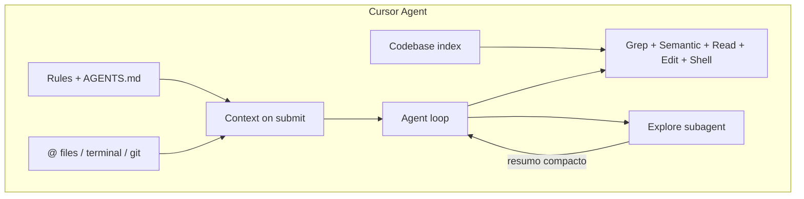

# Plano: Luna IDE com consciência de código estilo Cursor

## O que o Cursor faz (pesquisa oficial)

O Cursor **não** envia cada tecla em tempo real ao LLM. A “consciência” vem de **camadas combinadas** no momento do pedido e durante o loop do agente:

| Camada | Como funciona no Cursor | Estado na Luna |
|--------|-------------------------|----------------|
| **Context compiler** | No envio: ficheiros abertos, @mentions, regras, resumo | Só paths no system ([`workspaceContextBlock.ts`](src/lib/workspaceContextBlock.ts)) |
| **@ mentions** | `@ficheiro`, `@pasta/`, `@Terminals`, `@Git diff`, `@Docs`, regras | Não existe |
| **Codebase index** | Chunks + embeddings; sync ~5 min; disponível ~80% | RAG manual (“Indexar workspace”) |
| **Busca do agente** | Grep instantâneo + **semantic search** encadeados; subagente **Explore** | `grep`/`glob` só; RAG via tool opcional |
| **Regras** | `.cursor/rules` (globs, alwaysApply), `AGENTS.md` aninhado | Só prompts fixos em código |
| **Edição** | Apply automático + **Checkpoints** para desfazer | Patches **pendentes** até aceitar |
| **Terminal** | Executa e **lê output** no contexto | `run_terminal_command` existe; output não vai ao system |
| **Transparência** | Anel de contexto (tokens por categoria) | Não existe |
| **Instruções** | Team + Project + User rules no system | Personalidade + supplements |

Fontes: [Agent tools / search](https://cursor.com/docs/agent/tools/search), [@ mentions](https://cursor.com/docs/context/mentions), [Rules](https://cursor.com/docs/context/rules), [Agent overview](https://cursor.com/docs/agent/overview).



---

## Porque a Luna parece “confusa” (ex.: `modelo.py`)

1. **Só vê paths**, não o código no editor ([`buildAgentSystemPrompt.ts`](src/agent/buildAgentSystemPrompt.ts) passa `content: ''`).
2. **`write_file` = proposta pendente**, não ficheiro no disco — o modelo diz “não criei no computador” com razão técnica, mas sem linguagem alinhada ao fluxo UI.
3. **`read_file` / `apply_patch` leem disco** ([`executeTools.ts`](src/agent/executeTools.ts)) — buffers dirty e pendentes desalinham.
4. **Sem @git / @terminal** — não vê `ModuleNotFoundError: numpy` até correr tool (ou nunca se não correr).
5. **Sem índice automático** — em projectos médios, grep sozinho perde contexto (Cursor reporta +12.5% precisão com semantic+grep vs grep).

---

## Visão alvo: paridade prática com Cursor

**Princípio:** snapshot rico no submit + tools para aprofundar + índice semântico + regras de repo — não “omnisciência”.

### Fase A — Consciência imediata (P0) — já planeado, reforçado

#### A1. Context compiler — [`src/lib/ideContextCompiler.ts`](src/lib/ideContextCompiler.ts)

Por mensagem em modo IDE, injectar (com orçamento `LUNA_IDE_CONTEXT_MAX_CHARS`):

| Prioridade | Conteúdo |
|------------|----------|
| 1 | `@mentions` explícitos do utilizador |
| 2 | Ficheiro **activo** (código completo ou truncado) |
| 3 | Tabs **dirty** |
| 4 | **Patches pendentes** (path, summary, preview diff) |
| 5 | **Bloco verdade** disco / editor / pendente |
| 6 | **Terminal tail** (últimas 40 linhas) |
| 7 | **Git working diff** resumido (estilo `@Commit Working State`) |
| 8 | **2–4 chunks RAG** se índice do workspace activo |

Bloco verdade (anti-confusão):

```text
Estado factual (não inventar):
- disco: modelo.py → ausente | presente (N bytes)
- editor: modelo.py → aberto, dirty=true, 142 linhas
- pendente: proposal #id write_file modelo.py (aguarda aceitar na UI)
Regra: "criado no computador" só se existir em disco OU auto-apply activo e patch aplicado.
```

#### A2. Snapshot expandido — [`ideTurnHost.ts`](src/lib/ideTurnHost.ts), [`LunaWorkspaceContext.tsx`](src/context/LunaWorkspaceContext.tsx)

```ts
openFiles: { path, content, dirty, languageId, selection?: { from, to } }[]
pendingPatches: { id, path, summary, oldContent, newContent }[]
terminalTail: string[]
lastCommand?: { command, exitCode }
gitWorkingDiffSummary?: string
```

#### A3. Fonte de verdade — [`workspaceFileContent.ts`](src/lib/workspaceFileContent.ts)

`resolveFileContent(path)` → `editor` | `disk` | `missing`; usar em todas as tools de ficheiro.

#### A4. Refresh entre steps — [`runAgentTurn.ts`](src/agent/runAgentTurn.ts)

Após cada tool em IDE: system curto «estado actualizado» + snapshot fresco (evita step 3 ignorar `write_file` do step 2).

---

### Fase B — @mentions estilo Cursor (P1)

Além de ficheiro/pasta, suportar no [`ChatComposer.tsx`](src/components/ChatComposer.tsx):

| Mention | Origem | Uso |
|---------|--------|-----|
| `@path/to/file` | Explorador + tabs | Forçar contexto |
| `@src/` | Pasta | Lista + limite de ficheiros |
| `@Terminal` | `terminalLines` | Último output (como Cursor) |
| `@Git` | `git diff` porcelain curto | Alterações não commitadas |
| `@Regras` / `@AGENTS.md` | `.luna/rules` | Inject regras do projecto |

Guardar `attachedContexts[]` na mensagem; passar ao compiler.

---

### Fase C — Índice e busca como Cursor (P1)

#### C1. Indexação automática do workspace

- Ao abrir pasta no IDE: indexar em background (reutilizar pipeline RAG em [`server/`](server/)).
- **Watch** debounced (ex. 5 min ou on-save) — só ficheiros alterados.
- **`.lunaignore`** (como `.cursorignore`): `node_modules`, `dist`, `.git`, etc.

#### C2. Tool `search_codebase` (semantic)

- Query em linguagem natural → top-K chunks do índice do `workspaceRoot`.
- Agente encadeia: `search_codebase` (onde?) → `grep` (detalhe) → `read_file` (ficheiro) — política em [`ideSystemSupplement.ts`](src/agent/ideSystemSupplement.ts).

#### C3. Subagente / passo Explore (simplificado)

Para pedidos amplos («mapear fluxo de pagamento»):

1. Passo interno só com `grep` + `glob` + `search_codebase` (modelo rápido ou mesmo modelo com `max_steps` dedicado).
2. Resumo compacto injectado no loop principal — evita encher o chat com 20 `read_file`.

*Nota:* versão completa = Task/subagent como no Cursor; v1 = passo de planeamento obrigatório quando `turn_kind=explore` no planning existente.

---

### Fase D — Regras de projecto (P1–P2)

Espelhar [Cursor Rules](https://cursor.com/docs/context/rules):

| Mecanismo | Implementação Luna |
|-----------|-------------------|
| `.luna/rules/*.md` | Frontmatter: `globs`, `alwaysApply`, `description` |
| `AGENTS.md` | Raiz + subpastas (instruções por área) |
| Fetch no compiler | Regras `alwaysApply` + regras cujo `glob` bate no ficheiro activo / @mentions |
| UI | «Regras do projecto» no painel IDE (lista + editar) |

Exemplo:

```markdown
---
globs: "**/*.py"
alwaysApply: false
---
- Usar venv em ./venv; dependências em requirements.txt
- Nunca commitar __pycache__
```

---

### Fase E — Ambiente de execução (P2)

| Feature | Cursor | Luna proposta |
|---------|--------|---------------|
| Terminal no context | `@Terminals` | Terminal tail no compiler + após `run_terminal_command` |
| Erros de lint | Diagnostics | Fase 2: integrar `tsc --noEmit` / LSP se disponível |
| Git | `@Commit (Diff)` | `git_status` + diff resumido no compiler |
| Auto-apply edits | Sim (default) | **Toggle** `luna-ide-auto-apply` (pedido teu: ambos) |
| Checkpoints | Antes de edits grandes | Snapshot JSON local antes de `acceptPatch` / auto-apply |

---

### Fase F — UX de confiança (P2–P3)

- **Anel / tab “Contexto”** no composer: % estimado + lista (system, regras, código injectado, tools, chat) — inspirado no breakdown do Cursor.
- **Checkpoints** na timeline da mensagem: «Restaurar antes deste patch».
- **Fila de mensagens** enquanto agente trabalha (opcional, como Cursor queue).

---

### Fase G — Prompt e política de agente (transversal)

Actualizar [`ideSystemSupplement.ts`](src/agent/ideSystemSupplement.ts):

```
Fluxo Cursor-like:
1. Ler contexto injectado (activo, @mentions, git, terminal) — não repetir read_file à toa.
2. Se não souber onde está o código → search_codebase ou grep, não adivinhar.
3. Explorar padrões existentes antes de criar ficheiros novos.
4. Editar → testar no terminal → reportar resultado real (exit code).
5. Nunca afirmar ficheiro criado sem verificar bloco "Estado factual".
```

Desactivar tools de chat irrelevantes em IDE (`web_search` já restrito).

---

## Configuração — [`.env.example`](.env.example)

```env
LUNA_IDE_CONTEXT_MAX_CHARS=18000
LUNA_IDE_ACTIVE_FILE_MAX_CHARS=12000
LUNA_IDE_TERMINAL_TAIL_LINES=40
LUNA_IDE_GIT_DIFF_MAX_CHARS=6000
LUNA_IDE_INDEX_AUTO=1
LUNA_IDE_INDEX_SYNC_MS=300000
```

`localStorage`: `luna-ide-auto-apply`, `luna-workbench-mode`.

---

## Limites honestos

| Meta | Alcance realista |
|------|------------------|
| “100% consciência” | Snapshot + índice + tools + regras ≈ Cursor em uso normal |
| Tempo real por tecla | Não — refresh por mensagem e entre steps |
| Repo infinito | Orçamento de chars + semantic search + grep |

---

## Ordem de implementação (actualizada)

| Fase | Itens | Impacto |
|------|-------|---------|
| **P0** | A1–A4 context compiler + resolveFileContent + refresh steps | Corrige confusão actual |
| **P1** | B @mentions (ficheiro, terminal, git) | Paridade Cursor básica |
| **P1** | C1–C2 índice auto + `search_codebase` | “Sabe onde está o código” |
| **P1** | G prompts | Comportamento coerente |
| **P2** | D regras `.luna/rules` + AGENTS.md | Conhecimento do projecto |
| **P2** | E auto-apply toggle + checkpoints + terminal/git no compiler | Ambiente real |
| **P2** | C3 passo Explore | Tarefas grandes |
| **P3** | F context tray + fila + diagnostics LSP | Polimento |

---

## Ficheiros principais

**Novos:** `ideContextCompiler.ts`, `workspaceFileContent.ts`, `lunaRulesLoader.ts`, `searchCodebaseTool.ts`, `.lunaignore`

**Alterar:** [`ideTurnHost.ts`](src/lib/ideTurnHost.ts), [`LunaWorkspaceContext.tsx`](src/context/LunaWorkspaceContext.tsx), [`buildAgentSystemPrompt.ts`](src/agent/buildAgentSystemPrompt.ts), [`runAgentTurn.ts`](src/agent/runAgentTurn.ts), [`executeTools.ts`](src/agent/executeTools.ts), [`ChatComposer.tsx`](src/components/ChatComposer.tsx), [`useConversations.ts`](src/hooks/useConversations.ts), [`ideSystemSupplement.ts`](src/agent/ideSystemSupplement.ts), servidor RAG/indexação

**Docs:** [`docs/luna-ide-tools.md`](docs/luna-ide-tools.md)

---

## Decisões já confirmadas contigo

- **Patches:** pendente por defeito + toggle «aplicar automaticamente».
- **Contexto:** automático generoso + @mentions no composer.

Quando quiseres **executar**, diz por exemplo: «implementa o plano» ou «começa pela fase P0».
