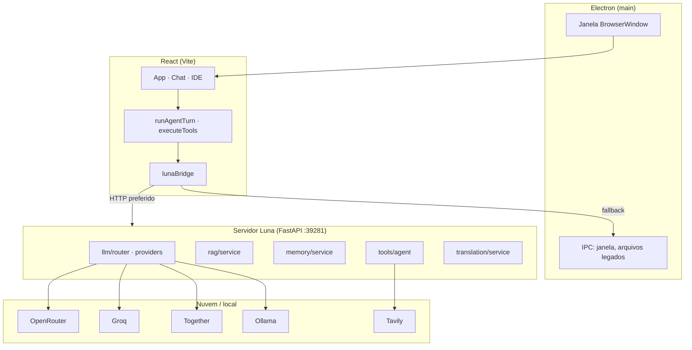

# Luna

**Assistente de IA para desktop** com chat, IDE integrado, agente com ferramentas e memória semântica. Projeto **Lunar**.

Interface em português brasileiro · Electron + React + servidor Python (FastAPI).

---

## Índice

- [Visão geral](#visão-geral)
- [Funcionalidades](#funcionalidades)
- [Stack tecnológica](#stack-tecnológica)
- [Arquitetura](#arquitetura)
- [Modos de trabalho](#modos-de-trabalho)
- [Agente e ferramentas](#agente-e-ferramentas)
- [Memória e RAG](#memória-e-rag)
- [Provedores de LLM](#provedores-de-llm)
- [Estrutura do projeto](#estrutura-do-projeto)
- [Pré-requisitos](#pré-requisitos)
- [Instalação](#instalação)
- [Configuração](#configuração)
- [Desenvolvimento](#desenvolvimento)
- [Build e produção](#build-e-produção)
- [API do servidor](#api-do-servidor)
- [Atalhos e dicas](#atalhos-e-dicas)
- [Documentação adicional](#documentação-adicional)
- [Roadmap](#roadmap)
- [Licença](#licença)

---

## Visão geral

A **Luna** é um aplicativo desktop que une conversa com IA, edição de código e execução de comandos em um único ambiente. Em vez de vários agentes separados, há **uma Luna** que escolhe ferramentas a cada turno — memória, pesquisa em documentos, visão, arquivos, terminal, git e alterações no workspace.

O fluxo de desenvolvimento sobe três processos em paralelo:

1. **Vite** — interface React (porta `5173`)
2. **Servidor Python** — LLM, RAG, memória e ferramentas (porta `39281`)
3. **Electron** — janela nativa com preload seguro

Em produção, a UI é servida a partir de `dist/` e o servidor continua local.

---

## Funcionalidades

| Área | O que faz |
|------|-----------|
| **Chat** | Conversa geral, anexos de imagem, seleção de modelo, pensamento visível (reasoning) |
| **IDE** | Explorer, editor CodeMirror, terminal xterm, patches pendentes com aprovação |
| **Agente** | Até 8 passos por turno (chat) ou 25 (IDE); ferramentas declaradas ao modelo |
| **Memória** | Notas persistentes + recall semântico em conversas anteriores |
| **RAG** | Indexação de pastas/arquivos para `search_documents` |
| **Visão** | Lunar Vision — análise de imagens via `describe_images` |
| **Tradução** | UI multilíngue; bloco de pensamento traduzível |
| **Pesquisa web** | Tavily (opcional) via `web_search` |

---

## Stack tecnológica

| Camada | Tecnologias |
|--------|-------------|
| **Desktop** | Electron 39, preload com `contextBridge` |
| **Frontend** | React 19, TypeScript, Vite 8, Tailwind CSS 4 |
| **Editor** | CodeMirror 6 (várias linguagens) |
| **Terminal** | xterm.js |
| **Backend** | Python 3.11+, FastAPI, Uvicorn, httpx |
| **Dados** | SQLite (sql.js no renderer; índices no servidor) |
| **LLM** | OpenRouter, Groq, Together, Ollama (API compatível OpenAI) |

---

## Arquitetura

### Visão em camadas



### Ponte HTTP vs IPC

O renderer usa `lunaBridge.ts`: tenta o **servidor HTTP** (`window.lunaServer.baseUrl`) e, se indisponível, cai para **IPC Electron** (`window.llm`, `window.rag`, etc.).

| Variável | Efeito |
|----------|--------|
| `LUNA_USE_SERVER=1` | Preload expõe `lunaServer`; dev usa HTTP |
| `LUNA_USE_SERVER=0` | Só IPC no processo Electron |

Dados persistentes (RAG, memória semântica): `%APPDATA%\Luna\userData` ou `LUNA_DATA_DIR`.

### Fluxo de um turno do agente

```mermaid
sequenceDiagram
  participant U as Usuário
  participant UI as React
  participant A as runAgentTurn
  participant B as lunaBridge
  participant S as Servidor / IPC
  participant M as Modelo LLM

  U->>UI: Enviar mensagem
  UI->>A: runAgentTurn (max 8 ou 25 passos)
  loop Até texto final ou limite
    A->>B: chat / chatStream + tool schemas
    B->>S: POST /v1/llm/chat/stream
    S->>M: API do provedor
    M-->>S: tool_calls ou texto
    S-->>A: resposta
  A->>A: executeTools (memória, RAG, IDE…)
  A-->>UI: mensagem + agentSteps
  UI-->>U: Markdown + timeline de ferramentas
```

**Arquivos centrais do agente:**

| Arquivo | Papel |
|---------|--------|
| `src/agent/runAgentTurn.ts` | Orquestração do turno (`MAX_AGENT_STEPS = 8`) |
| `src/agent/executeTools.ts` | Execução de cada ferramenta |
| `src/agent/toolSchemas.ts` | Schemas OpenAI + labels de UI |
| `src/agent/buildAgentSystemPrompt.ts` | System prompt do agente |
| `src/hooks/useConversations.ts` | Persistência de mensagens e turnos |

Especificação detalhada: [`docs/luna-brain-v1-spec.md`](docs/luna-brain-v1-spec.md).

---

## Modos de trabalho

A Luna alterna entre dois modos (`luna-workbench-mode` no `localStorage`):

### Chat

- Janela compacta (~560×780)
- Foco em conversa, memórias e anexos
- Agente com ferramentas gerais (memória, RAG, arquivos permitidos, web)

### IDE

- Janela ampla (~1280×800)
- Explorer, editor, terminal integrado
- Contexto injetado: arquivo ativo, tabs sujas, terminal, git diff, regras (`.luna/rules`, `AGENTS.md`)
- Menções: `@arquivo.py`, `@Terminal`, `@Git`, `@Regras`
- Até **25 passos** por turno (`MAX_AGENT_STEPS_IDE`)

Documentação das ferramentas IDE: [`docs/luna-ide-tools.md`](docs/luna-ide-tools.md).

---

## Agente e ferramentas

A Luna **não injeta** RAG nem recall automaticamente no envio — o modelo chama as tools quando precisa.

### Ferramentas — modo Chat

| Ferramenta | Descrição | Onde executa |
|------------|-----------|--------------|
| `save_memory` | Grava nota na memória do usuário | Renderer |
| `configure_memories` | Abre painel de memórias | Renderer |
| `search_documents` | Busca no índice RAG | Servidor |
| `search_past_conversations` | Recall em chats anteriores | Servidor |
| `describe_images` | Análise visual (Lunar Vision) | Servidor / provedor |
| `list_directory` | Lista pasta permitida | Servidor |
| `read_file` | Lê arquivo (allowlist) | Servidor |
| `web_search` | Pesquisa web (Tavily) | Servidor |

### Ferramentas — modo IDE (adicional)

| Ferramenta | Descrição | Aprovação |
|------------|-----------|-----------|
| `search_codebase` | Busca semântica no workspace | Automática |
| `write_file` | Grava arquivo completo | UI (ou auto) |
| `apply_patch` | Substitui trecho no arquivo | UI (ou auto) |
| `grep` / `glob` | Busca no código | Automática |
| `run_terminal_command` | Comando no terminal | Automática |
| `git_status` / `git_diff` / `git_commit` | Operações git | commit pendente |

Patches e escritas ficam **pendentes** até aceitar na UI (ou com «Aplicar patches auto» no `localStorage`).

### Regras do projeto

Coloque regras em `.luna/rules/*.md` com frontmatter `globs` / `alwaysApply`, ou use `AGENTS.md` na raiz. Arquivos ignorados na indexação: [`.lunaignore`](.lunaignore).

---

## Memória e RAG

### Memória do usuário

- Notas explícitas via `save_memory` ou captura automática pós-turno (`luna-auto-memory-capture`)
- Recall semântico com embeddings (OpenRouter, Groq, Together ou Ollama)
- Endpoints: `/v1/memory/sync`, `/v1/memory/retrieve`, `/v1/memory/status`

### RAG (documentos)

- Indexe pastas ou arquivos pela UI ou API
- Consulta via `search_documents` no agente
- Endpoints: `/v1/rag/index/folder`, `/v1/rag/retrieve`, `/v1/rag/status`

---

## Provedores de LLM

Configuração em `.env` (modelo em [`.env.example`](.env.example)).

| Provedor | Uso típico |
|----------|------------|
| **OpenRouter** | Chat, visão, embeddings; modelos free e reasoning |
| **Groq** | Chat rápido, reasoning `gpt-oss` |
| **Together** | Chat + visão (DeepSeek, Llama Vision) |
| **Ollama** | Modelos locais (ex.: Qwen3.5) sem nuvem |

| Variável | Descrição |
|----------|-----------|
| `LLM_PRIMARY` | `openrouter` \| `groq` \| `together` \| `ollama` |
| `LLM_FALLBACK_ENABLED` | Tenta próximo provedor na cadeia se falhar |
| `LLM_CLOUD_ENABLED` | `0` força só Ollama |
| `LUNA_MODELS` | Catálogo customizado no seletor (`provider\|model\|rótulo`) |

Ordem de fallback (exemplo com `LLM_PRIMARY=groq`): Groq → OpenRouter → Together → Ollama.

---

## Estrutura do projeto

```
Luna/
├── src/                    # Interface React
│   ├── agent/              # Agente: turno, tools, prompts
│   ├── components/         # UI (chat, IDE, painéis)
│   ├── hooks/              # Conversas, atalhos, saúde do servidor
│   ├── lib/                # Bridge LLM, RAG, memória, IDE
│   └── translation/        # i18n e tradução de reasoning
├── electron/               # Processo principal Electron + handlers IPC
├── backend/
│   └── luna/               # Servidor FastAPI (LLM, RAG, tools, tradução)
├── scripts/                # Dev: subir servidor, Electron, instalar Python
├── docs/                   # Especificações (agente, IDE)
├── dev.bat                 # Atalho Windows: dev completo
├── dev-stop.bat            # Encerra processos de dev
├── .env.example            # Modelo de configuração (sem segredos)
└── package.json
```

---

## Pré-requisitos

- **Node.js** 20 ou superior
- **Python** 3.11 ou superior (servidor local)
- **Windows** (scripts `dev.bat` / `dev-stop.bat`; Linux/macOS possível via `npm run`, sem `.bat`)
- Chaves de API de pelo menos um provedor (OpenRouter, Groq ou Together) — ou Ollama local

---

## Instalação

```bash
# 1. Clonar
git clone https://github.com/NowardEthan/Luna.git
cd Luna

# 2. Dependências Node
npm install

# 3. Ambiente Python do servidor
npm run server:install

# 4. Configuração
copy .env.example .env
# Edite .env com suas chaves (nunca commite o .env)
```

---

## Configuração

Copie [`.env.example`](.env.example) para `.env`. O arquivo `.env` **não é versionado**.

### Essencial

```env
LUNA_SERVER_PORT=39281
LUNA_USE_SERVER=1
LLM_PRIMARY=openrouter
OPENROUTER_API_KEY=sua_chave_aqui
```

### Pesquisa web (opcional)

```env
WEB_SEARCH_PROVIDER=tavily
TAVILY_API_KEY=sua_chave
```

### Dados

```env
# Opcional — padrão: %APPDATA%\Luna\userData
# LUNA_DATA_DIR=C:\Users\voce\AppData\Luna\userData
```

### Catálogo de modelos no chat

```env
LUNA_MODELS=openrouter|baidu/cobuddy:free|CoBuddy (free)|groq|openai/gpt-oss-120b|Groq
```

Consulte `.env.example` para Ollama, reasoning, RAG, limites do IDE e tradução.

---

## Desenvolvimento

### Atalho Windows (recomendado)

```bat
dev.bat
```

Sobe servidor Python + Vite + Electron em uma janela. Feche a janela ou use `dev-stop.bat` para encerrar.

### Via npm

```bash
npm run dev          # servidor + vite + electron
npm run dev:web      # só interface (navegador)
npm run server       # só servidor Python
npm run server:kill  # mata processo na porta 39281
```

### Lint

```bash
npm run lint
```

### Primeira execução

1. `npm run server:install` cria `backend/.venv`
2. Configure `.env`
3. `dev.bat` ou `npm run dev`
4. No onboarding: **Chat** para conversa; **IDE** para código

---

## Build e produção

```bash
npm run build        # tsc + vite build → dist/
npm run electron:run # build + electron com dist/
```

Em produção, defina `NODE_ENV=production` e mantenha o servidor Python acessível se `LUNA_USE_SERVER=1`.

---

## API do servidor

Base: `http://127.0.0.1:39281` (configurável via `LUNA_SERVER_HOST` / `LUNA_SERVER_PORT`).

| Método | Rota | Descrição |
|--------|------|-----------|
| `GET` | `/health` | Saúde do serviço |
| `GET` | `/v1/models` | Catálogo de modelos |
| `POST` | `/v1/llm/chat` | Chat completo |
| `POST` | `/v1/llm/chat/stream` | Chat em SSE |
| `POST` | `/v1/llm/vision` | Descrição de imagens |
| `POST` | `/v1/translate` | Tradução de texto |
| `GET` | `/v1/rag/status` | Estado do índice RAG |
| `POST` | `/v1/rag/index/folder` | Indexar pasta |
| `POST` | `/v1/rag/retrieve` | Busca RAG |
| `POST` | `/v1/memory/sync` | Sincronizar memória |
| `POST` | `/v1/memory/retrieve` | Busca em conversas |
| `POST` | `/v1/tools/*` | Ferramentas do agente (arquivo, git, terminal…) |
| `GET` | `/v1/diagnostics/logs` | Logs recentes do servidor |

---

## Atalhos e dicas

| Atalho | Ação |
|--------|------|
| `Ctrl+K` | Seletor de modelo no compositor |
| Modo IDE | Use `@arquivo` para contexto explícito |
| Memórias | Painel «Memórias da Luna» na barra lateral |

**localStorage útil:**

| Chave | Valores |
|-------|---------|
| `luna-workbench-mode` | `chat` \| `ide` |
| `luna-auto-memory-capture` | `1` ligado · `0` desligado |
| `luna-ide-auto-apply` | `1` aplica patches sem confirmação |
| `luna-ui-locale` | Idioma da interface |

---

## Documentação adicional

| Documento | Conteúdo |
|-----------|----------|
| [`docs/luna-brain-v1-spec.md`](docs/luna-brain-v1-spec.md) | Especificação do agente v1 |
| [`docs/luna-ide-tools.md`](docs/luna-ide-tools.md) | Ferramentas e contexto do modo IDE |

---

## Roadmap

Itens planejados (pós v1 do agente):

- [ ] Streaming completo da resposta principal
- [ ] Proatividade leve com opt-in
- [ ] Voz (TTS / STT)

---

## Licença

Projeto pessoal — consulte o autor antes de redistribuir ou usar comercialmente.

---

<p align="center">
  <strong>Luna</strong> · Projeto Lunar · <a href="https://github.com/NowardEthan/Luna">GitHub</a>
</p>
