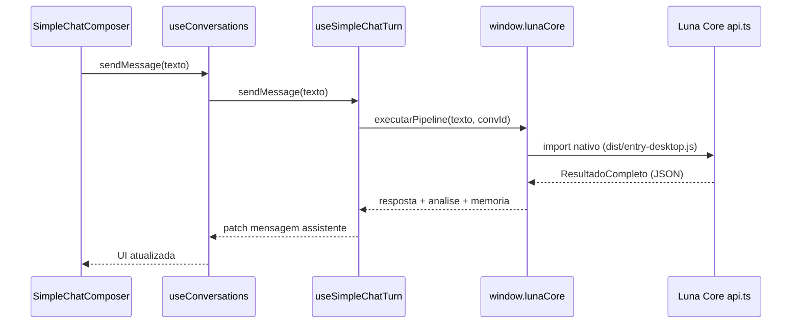

# Arquitetura Orbit

Plataforma modular para chat com Luna Core, IDE e addons. Este documento descreve as camadas e o fluxo de um turno de chat.

## Camadas

| Camada | Pasta | Responsabilidade |
|--------|-------|------------------|
| Shell | `src/shell/` | `AppProviders`, `AppShell`, `ChatColumn`, registo de UI built-in |
| Features | `src/features/` | Domínios: `chat/`, `history/`, `memories/`, `settings/`, `ide/` |
| Components | `src/components/` | Componentes legados; re-exportam `features/` e `ui/` |
| UI | `src/ui/` | Design system (Panel, Stack, Select, …) |
| Core | `src/core/` | Registries, plugins, eventos, MCP, conversação |
| Agent | `src/agent/` | Turno do agente legado (ferramentas via `ToolRegistry`) — IDE futuro |
| Plugins | `src/plugins/builtin/` + `.luna/plugins/` | Extensões internas e externas |

## Registries

- **ToolRegistry** — schemas e handlers (`registerBuiltinTools` no boot)
- **PanelRegistry** / **CommandRegistry** — painéis laterais e paleta de comandos
- **ThemeRegistry** — temas (`data-luna-theme` no `<html>`)
- **ConversationStore** — API de conversas; implementação `ChatStore` em `features/chat/state/`

## Estado do chat

O hook `useConversations` (`src/hooks/`) é uma fachada fina que compõe:

- `conversationPersistence` — hydrate / localStorage
- `conversationListStore` / `folderStore` — conversas e pastas
- `userMemoryStore` / `chatPreferencesStore` — memória e preferências (personalidade, RAG)
- `useSimpleChatTurn` — `sendMessage` via Luna Core

`agent/` e `core/` **não** importam `useConversations`; usam `getConversationStore()`.

## Fluxo de um turno (chat principal)

**Arquivos centrais:**

| Arquivo | Papel |
|---------|--------|
| `src/features/chat/useSimpleChatTurn.ts` | Turno do chat via Luna Core |
| `src/features/chat/SimpleChatComposer.tsx` | Composer fixo Luna · PAIA |
| `src/shell/ChatColumn.tsx` | Layout da coluna de chat |
| `src/hooks/useConversations.ts` | Fachada React; estado em `src/features/chat/state/` |
| `electron/main.cjs` | IPC `lunaCore:executarPipeline` |
| `luna-core/src/cli/api.ts` | CLI JSON (`ambiente: desktop`) |

Legado multi-LLM (`runAgentTurn`, `ChatComposer`, `ModelSelector`) está em `src/_archive/chat-legacy/`.

## Backend

O servidor Python (`backend/run_server.py`) permanece activo para RAG, memória semântica, visão e **agente IDE/Finanças**. O **chat principal** usa Luna Core via `useSimpleChatTurn`; IDE e Finanças usam `useChatTurn` → `runAgentTurn` (ver [`luna-ide-core-bridge.md`](./luna-ide-core-bridge.md)).

`POST /v1/tools/invoke` com allowlist em `backend/luna/tools/router.py`.

O servidor legado `server/app.cjs` está **obsoleto**.

## Plugins e MCP

- Manifestos: `.luna/plugins/<id>/plugin.json`
- `PluginHost.discover()` + activação com permissões (`core/plugin/permissions.ts`)
- **`trusted: true`** — `activate()` no thread principal (painéis, comandos, settings React).
- **`trusted: false`** — módulo só no **Web Worker** (`pluginWorkerEntry.ts`); ferramentas invocam via `postMessage`; `registerPanel` / UI no worker é rejeitado.
- MCP: `McpToolProvider.connect()` regista `mcp__<serverId>__<nome>` com invocação HTTP (`mcpClient.ts`).

## Temas e layout

- Paletas em `src/lib/lunaThemes.ts`; `ThemeRegistry.setActive()` aplica CSS vars e emite `theme:changed`.
- CodeMirror (IDE + blocos no chat) e xterm seguem as vars do tema activo.
- Splits: `ResizableSplit` + `panelLayoutStorage` (`ratio` + `px` em `localStorage`).

## Integração Luna Core

Ver [`luna-core-integration-roadmap.md`](./luna-core-integration-roadmap.md) para fases, configuração (`LUNA_CORE_PATH`) e legado a deprecar.

## Tutorial rápido

1. Configurar `LUNA_CORE_PATH` e `.env` do Luna Core (ver README).
2. `npm run dev` — sobe Vite, Python (opcional) e Electron.
3. Novo chat pela barra lateral ou `Ctrl+N`.
4. Modo IDE na Activity Bar para editar ficheiros.
5. Definições → Plugins: confirme o aviso de risco antes de activar extensões.
