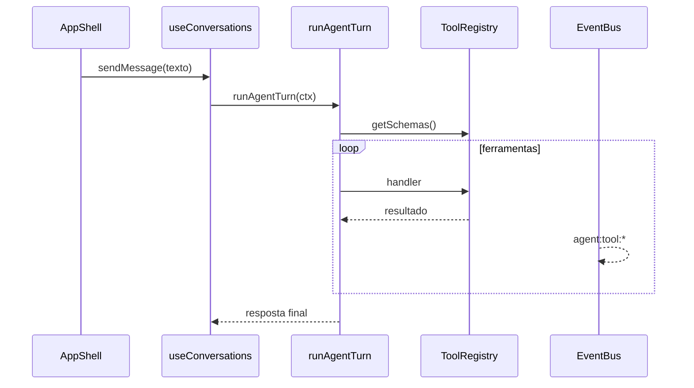

# Arquitetura Luna

Plataforma modular para chat, IDE e agente com ferramentas. Este documento descreve as camadas e o fluxo de um turno.

## Camadas

| Camada | Pasta | Responsabilidade |
|--------|-------|------------------|
| Shell | `src/shell/` | `AppProviders`, `AppShell`, registo de UI built-in |
| Features | `src/features/` | Domínios: `chat/`, `history/`, `memories/`, `settings/`, `ide/` |
| Components | `src/components/` | Componentes legados; re-exportam `features/` e `ui/` |
| UI | `src/ui/` | Design system (Panel, Stack, Select, …) |
| Core | `src/core/` | Registries, plugins, eventos, MCP, conversação |
| Agent | `src/agent/` | Turno do agente (ferramentas via `ToolRegistry`) |
| Plugins | `src/plugins/builtin/` + `.luna/plugins/` | Extensões internas e externas |

## Registries

- **ToolRegistry** — schemas e handlers (`registerBuiltinTools` no boot)
- **PanelRegistry** / **CommandRegistry** — painéis laterais e paleta de comandos
- **ThemeRegistry** — temas (`data-luna-theme` no `<html>`)
- **ConversationStore** — API de conversas; implementação `ChatStore` em `features/chat/state/`

## Estado do chat

O hook `useConversations` (`src/hooks/`) é uma fachada fina que compõe:

- `conversationPersistence` — hydrate / localStorage
- `conversationListStore` / `folderStore` — conversas e pastas
- `userMemoryStore` / `modelCatalogStore` — memória e modelo
- `agentTurnService` — `sendMessage`, redo, `runAgentTurn`

`agent/` e `core/` **não** importam `useConversations`; usam `getConversationStore()`.

## Fluxo de um turno

## Backend

`POST /v1/tools/invoke` com allowlist carregada de `shared/tool-catalog.json` em `backend/luna/tools/router.py`.

O servidor legado `server/app.cjs` está **obsoleto** — use `backend/run_server.py` (ver README).

## Plugins e MCP

- Manifestos: `.luna/plugins/<id>/plugin.json`
- `PluginHost.discover()` + activação com permissões (`core/plugin/permissions.ts`)
- **`trusted: true`** — `activate()` no thread principal (painéis, comandos, settings React).
- **`trusted: false`** — módulo só no **Web Worker** (`pluginWorkerEntry.ts`); ferramentas invocam via `postMessage`; `registerPanel` / UI no worker é rejeitado.
- MCP: `McpToolProvider.connect()` regista `mcp__<serverId>__<nome>` com invocação HTTP (`mcpClient.ts`).

## Temas e layout

- Paletas em `src/lib/lunaThemes.ts`; `ThemeRegistry.setActive()` aplica CSS vars e emite `theme:changed`.
- CodeMirror (IDE + blocos no chat) e xterm seguem as vars do tema activo.
- Splits: `ResizableSplit` + `panelLayoutStorage` (`ratio` + `px` em `localStorage`).

## Tutorial rápido

1. `npm run dev` — sobe Vite, Python e Electron.
2. Novo chat pela barra lateral ou `Ctrl+N`.
3. Modo IDE na Activity Bar para editar ficheiros.
4. Definições → Plugins: confirme o aviso de risco antes de activar extensões.
5. Para criar um plugin, adicione uma pasta em `.luna/plugins/<id>/` com `plugin.json` válido.
