# Roadmap de internacionalização (i18n) — Luna

Plano de implementação para cobrir **toda** a interface da aplicação com o motor global (`i18next` + locales estáticos + tradução dinâmica). Atualizado com base no inventário do código em maio/2026.

---

## Objetivos

| Objetivo | Critério de sucesso |
|----------|---------------------|
| **Cobertura UI** | Nenhum texto visível ao utilizador hardcoded em PT/EN fora de `en.json` / `pt.json` (exceto nomes próprios, URLs, IDs técnicos). |
| **Paridade EN/PT** | Toda chave em `en.json` existe em `pt.json` e vice-versa (validado por script). |
| **EN como fonte da verdade** | Novas chaves entram primeiro em `en.json`; `pt.json` é a tradução manual; idiomas dinâmicos derivam de `en` via `dynamicLoader`. |
| **Sem fallbacks enganosos** | Remover padrão `t('chave', 'Texto PT')` em produção — fallback só em dev ou ausente de propósito. |
| **Acessibilidade** | `aria-label`, `title`, `placeholder` passam por i18n como o resto. |
| **Plugins** | Add-ons oficiais (Finanças, IDE) expõem strings via namespace próprio ou bridge documentado. |

---

## Arquitetura atual (referência)

```
src/i18n/
  index.ts           # init i18next, sync com readUiLocale()
  dynamicLoader.ts   # pt/en nativos; outros idiomas = traduzir en.json via API
  locales/
    en.json          # fonte (também usada pelo dynamic loader)
    pt.json          # tradução manual
src/translation/     # preferências UI, API translateText, locales suportados
```

**Idiomas core:** `pt`, `en` (bundles estáticos).  
**Idiomas dinâmicos:** `es`, `fr`, `de`, `it`, `ja`, `ko`, `zh` (cache `localStorage`, chaves espelhando `en.json`).

**Componentes já migrados (~19):** `ChatComposer`, `ChatMessageColumn`, `ChatSessionToolbar`, `PersonalityControls`, `HistoryPanel`, `MemoriesPanel`, `ActivityBar`, `StatusBar`, `TitleBar`, `ContextRail`, `LocaleSelect`, `SettingsNav`, `PreferencesView`, secções `Conversation`, `Appearance`, `Documents`, `Memory`, `Cloud`, `McpServers`.

**Cobertura estimada hoje:** ~85–90% das superfícies de UI (fases 0–10 concluídas em maio/2026).

---

## Convenções (aplicar em todas as fases)

### Estrutura de chaves

```
<namespace>.<subnamespace>.<nome>
```

| Namespace | Conteúdo |
|-----------|----------|
| `common` | Salvar, cancelar, apagar, ligado/desligado, erros genéricos |
| `composer` | Campo de mensagem, anexos, enviar/parar |
| `chat` | Bolhas, turno, raciocínio, imagens, vazio |
| `toolbar` | Tom, idioma, export, nova conversa |
| `personalities` | Perfis da Luna (já existe) |
| `activityBar` / `contextRail` / `statusBar` / `titleBar` | Navegação global |
| `history` | Painel + subpastas (tags, pastas, bulk, sync) |
| `memories` | Painel + editor + list item |
| `settings` | Nav + todas as secções (incl. `settings.addons`) |
| `shortcuts` | Modal de atalhos + descrições na paleta |
| `commandPalette` | Título, placeholder, grupos de comandos |
| `onboarding` | Cartão de boas-vindas |
| `lunarAccount` | Gate, modal, perfil, chip, banner, quota |
| `marketplace` | Página, cards, detalhe, publicar, categorias |
| `ide` | Explorer, editor, terminal, patches, checkpoints |
| `files` | Explorador Luna (modal, picker) |
| `finances` | Todo o workbench e painéis |
| `rag` | Controlos de documentos indexados |
| `diagnostics` | Painel de diagnóstico de turno |
| `confirm` | Títulos/mensagens de `requestConfirm` reutilizáveis |
| `toast` | Mensagens curtas de feedback |
| `starters` | Sugestões iniciais (chat / IDE / finanças) |
| `errors` | Erros de sync, rede, plugin (quando mostrados na UI) |

### Regras de implementação

1. **Hook:** `const { t } = useTranslation()` no componente; em `.ts` sem React: `import i18n from '../i18n'` + `i18n.t('chave')`.
2. **Interpolação:** `t('finances.goal_progress', { percent: 42 })` — nunca concatenar strings traduzíveis.
3. **Plurais:** usar sufixos `_one` / `_other` do i18next onde necessário (ex. contagem de conversas).
4. **Listas dinâmicas:** categorias do marketplace → chave `marketplace.category.<id>` com fallback ao label do catálogo.
5. **Add-ons:** namespace `addon.<pluginId>.*` ou ficheiro JSON no plugin carregado com `i18n.addResourceBundle` no activate.
6. **Testes:** snapshots opcionais; teste unitário mínimo: paridade de chaves `en` ↔ `pt`.

### Anti-padrões a eliminar

- `t('x', 'Frase em português')` como substituto de `pt.json`.
- Duplicar labels em `settingsSections.ts` **e** JSON — manter só JSON; TS exporta `id` + metadados não traduzíveis.
- Texto em `const ROWS = [...]` sem passar por i18n (ex. `ShortcutsHelpModal`).
- Mensagens de `requestConfirm` inline nos handlers — extrair para `confirm.*`.

---

## Fases do roadmap

Visão geral (ordem recomendada por impacto × dependências):

```mermaid
flowchart LR
  F0[Fase 0 Fundação] --> F1[Fase 1 Shell global]
  F1 --> F2[Fase 2 Chat e turno]
  F2 --> F3[Fase 3 Histórico]
  F3 --> F4[Fase 4 Conta Lunar]
  F4 --> F5[Fase 5 Marketplace]
  F5 --> F6[Fase 6 IDE]
  F6 --> F7[Fase 7 Finanças]
  F7 --> F8[Fase 8 Settings restante]
  F8 --> F9[Fase 9 Libs e plugins]
  F9 --> F10[Fase 10 QA e dinâmico]
```



---

### Fase 0 — Fundação e ferramentas (1–2 dias) ✅

**Estado:** concluída.

**Objetivo:** tornar migrações repetíveis e evitar regressões.

| Tarefa | Entregável |
|--------|------------|
| Script `scripts/check-i18n-keys.cjs` | Falha CI se `en` e `pt` tiverem chaves diferentes |
| Script `scripts/find-hardcoded-ui.cjs` | Lista `aria-label`, `placeholder`, `title`, JSX `>texto<` suspeitos |
| Documentar em `contributing.md` | Link para este roadmap + regra “nova UI = nova chave” |
| Corrigir `en.json` | Remover chave duplicada `chat` (hoje há dois blocos `chat` no JSON) |
| Helper opcional `src/i18n/keys.ts` | Tipos TypeScript para chaves críticas (opcional, fase tardia) |

**Critério de conclusão:** `npm run i18n:check` verde no estado atual; lista de hardcoded gerada como baseline.

---

### Fase 1 — Shell e navegação global (2–3 dias) ✅

**Estado:** concluída.

**Impacto:** utilizador vê consistência em qualquer modo (chat, IDE, marketplace).

| Área | Ficheiros principais |
|------|----------------------|
| Shell | `shell/AppShell.tsx` |
| Atalhos | `components/ShortcutsHelpModal.tsx` |
| Paleta | `components/CommandPalette.tsx` + registos em `core/registry` / `shell/registerBuiltinUi.ts` |
| Boot | `components/AppBootSkeleton.tsx` |
| Onboarding | `components/OnboardingCard.tsx` |
| Modelo / RAG | `components/ModelSelector.tsx`, `components/RagControls.tsx` |
| ActivityBar | Completar `aria-label` (hoje misto com `title` traduzido) |
| ContextRail | `aria-label` fixos “Conversas” / “Memórias” → chaves |
| Chat toolbar | `ChatSessionToolbar` — aria-labels ainda PT fixo |
| Empty states | `ui/EmptyState.tsx`, usos em IDE/checkpoints |

**Chaves novas estimadas:** ~80–120.

**Critério de conclusão:** trocar idioma EN ↔ PT na shell sem texto PT residual nos elementos acima.

---

### Fase 2 — Chat, turno e agente na UI (3–4 dias) ✅

**Estado:** concluída.

| Área | Ficheiros |
|------|-----------|
| Turno | `AssistantTurn.tsx`, `TurnTimeline.tsx`, `TurnActivityPanel.tsx`, `TimelineRow.tsx` |
| Ferramentas | `chat/toolStepDetails.tsx`, `ToolMentionBadge.tsx`, `AgentToolsPanel.tsx` |
| Mídia | `ImageLightbox.tsx`, `MessageImageGallery.tsx`, `MarkdownCodeBlock.tsx`, `CopyMessageButton.tsx` |
| Raciocínio | `ReasoningTimelineContent.tsx`, `ReasoningToggle.tsx`, `ReasoningBadge.tsx` |
| Contexto | `ContextUsageIndicator.tsx`, `ContextCompactionNotice.tsx`, `ScrollToBottomFab.tsx` |
| Ações | `RedoTurnButton.tsx`, `TurnDiagnosticsPanel.tsx`, `AssistantErrorNotice.tsx` |
| Welcome | `WelcomeAssistantMessage.tsx`, `WelcomePartsInline.tsx`, `WelcomeFinanceBadge.tsx`, `WelcomeFolderBadge.tsx` |
| Starters | `features/chat/components/chatStarters.ts`, `contextualChatWelcome.ts` |

**Chaves novas:** ~150–200.

**Nota:** conteúdo **gerado pelo modelo** já passa pelo motor de tradução de mensagens; esta fase é só **cromo da UI**.

---

### Fase 3 — Histórico e pastas (2–3 dias) ✅

**Estado:** concluída.

| Área | Ficheiros |
|------|-----------|
| Lista | `ConversationListRow.tsx`, `ConversationTags.tsx`, `FolderTreeNode.tsx` |
| Modais | `FolderSettingsModal.tsx`, `FolderIconPickerModal.tsx`, `FolderIconCropModal.tsx` |
| Bulk / menu | `HistoryBulkActionsBar.tsx`, `HistoryOverflowMenu.tsx` |
| Sync UI | `CloudSyncIndicator.tsx`, `CloudSyncToggleButton.tsx`, `cloudIcons.tsx` (labels) |
| Util | `features/history/utils.ts` (strings user-facing), `folderVisuals.tsx` |

**Complementar** `HistoryPanel` (já migrado) com subcomponentes.

**Chaves novas:** ~100–130.

---

### Fase 4 — Conta Lunar e sync (2–3 dias) ✅

**Estado:** concluída.

| Área | Ficheiros |
|------|-----------|
| Auth UI | `LunarGateScreen.tsx`, `LunarAccountModal.tsx`, `LunarAccountSignIn.tsx`, `LunarAccountProfile.tsx` |
| Chips / banner | `LunarAccountChip.tsx`, `LunarCloudBanner.tsx`, `CloudStorageQuotaBar.tsx` |
| Stats | `lunarAccountStats.ts` (labels formatados) |
| Sync | Mensagens em `cloudSyncService.ts`, `useCloudSyncTick`, toasts de erro visíveis |
| Confirm | Sign out, apagar dados, etc. |

**Chaves novas:** ~90–110.

---

### Fase 5 — Marketplace (2 dias) ✅

**Estado:** concluída.

| Área | Ficheiros |
|------|-----------|
| Página | `MarketplacePage.tsx`, `MarketplaceProductCard.tsx` |
| Detalhe | `MarketplaceDetailModal.tsx`, `MarketplaceListingProfileView.tsx` |
| Publicar | `MarketplacePublishModal.tsx` |
| Catálogo | `lib/marketplaceCatalog.ts` → `marketplace.category.*` |
| Hook | `useMarketplace.ts` (estados vazios, erros) |

**Chaves novas:** ~120–150 (perfil de listing é denso).

---

### Fase 6 — IDE e workspace (3–4 dias) ✅

**Estado:** concluída.

| Área | Ficheiros |
|------|-----------|
| Workbench | `IdeWorkbench.tsx`, `IdePrimarySidebar.tsx`, `IdeSessionBanner.tsx` |
| Editor | `EditorPanel.tsx`, `FileExplorer.tsx`, `TerminalPanel.tsx` |
| Agente IDE | `PendingChangesPanel.tsx`, `PatchDiffPreview.tsx`, `WorkspaceCheckpointsPanel.tsx` |
| Menções | `IdeMentionPicker.tsx` |
| Context | `lib/ideContextConfig.ts`, `agent/ideSystemSupplement.ts` (só strings UI) |
| Plugin Luna IDE | `src/plugins/luna-ide/` UI strings |

**Chaves novas:** ~100–140.

---

### Fase 7 — Finanças (4–5 dias) — maior volume isolado ✅

**Estado:** concluída — workbench Finanças migrado para `finances.*`.

| Sub-área | Ficheiros |
|----------|-----------|
| Shell | `FinancesPage.tsx`, `FinancesWorkbench.tsx`, `FinancesMainPanel.tsx` |
| Painéis | `FinancesDashboard`, `AccountsPanel`, `TransactionsPanel`, `BudgetsPanel`, `BillsPanel`, `GoalsPanel`, `PiggyBanksPanel`, `CreditCardsPanel`, `RecurringPanel`, `AnalyticsPanel`, `NotificationsPanel`, `ReportsPanel` |
| Formulários | `FinanceFormFields.tsx`, `FinancesIcons.tsx` (tooltips) |
| Dados UI | `financesChatWelcome.ts`, categorias default, notificações `financesNotifications.ts` |
| Plugin | `addons/luna-finances`, `plugins/luna-finances/registerFinancesTools.ts` (nomes de ferramentas visíveis ao user) |
| Agente | `financesSystemSupplement.ts`, `lib/financesContextCompiler.ts` (instruções podem ficar EN; labels UI não) |

**Estratégia:** namespace `finances.<panel>.<field>`; tabela de ~40–60 chaves partilhadas (`finances.common.save`, `finances.common.delete`, moeda R$, etc.).

**Chaves novas:** ~350–450.

**Critério de conclusão:** workbench Finanças 100% EN/PT; chat contextual de finanças usa `starters` traduzidos.

---

### Fase 8 — Definições e memória (1–2 dias) ✅

**Estado:** concluída — add-ons, editor de memórias, `settingsSections` só com IDs.

| Área | Ficheiros |
|------|-----------|
| Add-ons | `AddonsSection.tsx`, `AddonDetailPanel.tsx`, `AddonSchemaForm.tsx` |
| Secções | Revisar `AddonsSection` + mensagens `installHint` |
| Memória | `MemoryNoteEditor.tsx`, `MemoryNoteListItem.tsx` |
| Nav | Remover duplicação `settingsSections.ts` → só IDs; labels 100% JSON |
| Secções já OK | Re-pass em `CloudSection` / `McpServersSection` para remover fallbacks PT |

**Chaves novas:** ~60–80.

---

### Fase 9 — Ficheiros, libs transversais e erros (2 dias) ✅

**Estado:** concluída — explorador Luna, confirm/toast, diagnósticos, contexto, `toolStep.*`.

| Área | Ficheiros |
|------|-----------|
| Explorador | `LunaFileExplorerModal.tsx`, `LunaFilePickerField.tsx`, `fileExplorerUtils.ts` |
| Confirms | `lib/confirm.ts` consumidores → `confirm.*` |
| Toasts | `lib/toast.ts` + call sites frequentes |
| Export | `lib/exportConversation.ts` |
| Personalidade | `lib/chatPersonality.ts` — alinhar com `personalities.*` (hoje duplicado?) |
| Resizable / UI | `ui/ResizableSplit.tsx`, `ui/ConfirmDialog.tsx` |

**Chaves novas:** ~50–70.

---

### Fase 10 — QA, idiomas dinâmicos e manutenção (2–3 dias) ✅

**Estado:** concluída — fallbacks `t('key', 'PT')` removidos em `src/`; cache dinâmico `luna-i18n-dynamic-v2-`; `npm run i18n:check` verde (~1040 chaves).

| Tarefa | Detalhe |
|--------|---------|
| Passagem EN completa | Revisão humana de `en.json` (tom consistente) |
| Passagem PT | Revisão PT-BR vs PT-PT (decisão: manter BR como padrão) |
| Invalidar cache dinâmico | Bump `STORAGE_KEY_PREFIX` ou versão no cache ao mudar chaves |
| Teste manual por idioma | `pt`, `en`, + 1 dinâmico (`es`) em cada modo: chat, IDE, finances, marketplace |
| Teste a11y | VoiceOver/NVDA: aria-labels traduzidos |
| CI | `i18n:check` no pipeline |
| Métricas | Relatório: % ficheiros com `useTranslation` / total TSX em `src` |

**Critério de “projeto completo”:** scripts verdes + checklist manual abaixo assinada.

---

## Inventário completo por pasta (checklist)

Marcar `[x]` ao concluir cada grupo.

### `src/components/` (legado / partilhado)

- [x] ActivityBar, HistoryPanel, MemoriesPanel, StatusBar, TitleBar, ContextRail, ChatSessionToolbar, PersonalityControls, LocaleSelect
- [x] CommandPalette, ShortcutsHelpModal, OnboardingCard, AppBootSkeleton
- [x] ModelSelector, RagControls, AgentToolsPanel, TurnDiagnosticsPanel
- [x] MemoryNoteEditor, MemoryNoteListItem
- [x] chat/* (turno, contexto, toolStep), files/*, ide/*, lunar/*, workbench/*

### `src/features/chat/`

- [x] ChatComposer, ChatMessageColumn, Welcome*, chatStarters, contextualChatWelcome

### `src/features/history/`

- [x] ConversationListRow, ConversationTags, Folder*, HistoryBulk*, CloudSync*, HistoryPanel

### `src/features/auth/` + `src/features/sync/`

- [x] TSX principais + mensagens user-facing nos serviços

### `src/features/marketplace/`

- [x] Todos

### `src/features/finances/`

- [x] Todos (~20+ ficheiros)

### `src/features/settings/`

- [x] Secções + nav + AddonsSection, AddonDetailPanel, AddonSchemaForm, settingsSections (só IDs)

### `src/shell/`

- [x] AppShell

### `src/plugins/` + `addons/`

- [x] luna-ide, luna-finances (UI + tool labels via namespaces)

### `src/ui/`

- [x] ConfirmDialog, EmptyState, ResizableSplit (labels)

---

## Estimativa de esforço

| Fase | Dias (dev focado) | Chaves ~acumuladas |
|------|-------------------|-------------------|
| 0 | 1–2 | — |
| 1 | 2–3 | 120 |
| 2 | 3–4 | 320 |
| 3 | 2–3 | 450 |
| 4 | 2–3 | 560 |
| 5 | 2 | 710 |
| 6 | 3–4 | 850 |
| 7 | 4–5 | 1300 |
| 8 | 1–2 | 1380 |
| 9 | 2 | 1450 |
| 10 | 2–3 | — |
| **Total** | **~22–31 dias** | **~1400–1500 chaves** |

Paralelização possível: Fase 7 (Finanças) em branch separada enquanto Fase 4–6 avançam noutra.

---

## Ordem alternativa (se prioridade for produto)

1. **Finanças (Fase 7)** — utilizadores do add-on veem 100% PT hoje.  
2. **Conta Lunar (Fase 4)** — login/sync é crítico.  
3. **Shell (Fase 1)** — primeira impressão.  
4. Resto conforme tabela acima.

---

## Checklist de aceitação final (release i18n v1)

- [x] `npm run i18n:check` sem diferenças en/pt (~1040 chaves)
- [ ] Grep de `aria-label="` / `placeholder="` sem matches em `src/**/*.tsx` (exceto allowlist documentada)
- [x] Zero `t('…', '…português…')` em ficheiros de produção
- [x] `settingsSections.ts` sem strings traduzíveis
- [x] `ShortcutsHelpModal` e `CommandPalette` traduzidos
- [ ] Modo `en`: nenhuma frase em português na UI (teste E2E manual 30 min)
- [ ] Modo `es` (dinâmico): UI carrega do cache ou API sem quebrar layout (textos longos)
- [x] Documentação: `contributing.md` + este ficheiro atualizados

---

## Manutenção pós-v1

1. **PR checklist:** nova string → `en.json` + `pt.json` na mesma PR.  
2. **Release:** ao adicionar chaves em massa, incrementar versão do cache dinâmico.  
3. **Add-ons de terceiros:** expor `manifest.i18n` ou ficheiro `locales/en.json` no pacote; carregar no `plugin:activated`.  
4. **Revisão trimestral:** correr `find-hardcoded-ui` e tratar drift.

---

## Scripts propostos (Fase 0)

Adicionar ao `package.json`:

```json
{
  "scripts": {
    "i18n:check": "node scripts/check-i18n-keys.cjs",
    "i18n:scan": "node scripts/find-hardcoded-ui.cjs"
  }
}
```

Implementação sugerida:

- **check-i18n-keys:** flatten `en.json` e `pt.json`, diff de chaves, exit 1 se diferente.  
- **find-hardcoded-ui:** ripgrep por padrões conhecidos; output CSV por ficheiro/linha para triagem.

---

## Referências no código

| Ficheiro | Papel |
|----------|-------|
| `src/i18n/index.ts` | Bootstrap i18n |
| `src/i18n/locales/en.json` | Fonte de verdade |
| `src/i18n/dynamicLoader.ts` | Idiomas além de pt/en |
| `src/translation/preferences.ts` | `readUiLocale()` |
| `src/components/translation/LocaleSelect.tsx` | Seletor na toolbar |
| `docs/architecture.md` | Camadas da app |

---

## Próximo passo imediato

1. Teste manual EN/PT/ES nos modos chat, IDE, finanças e marketplace.  
2. Correr `npm run i18n:scan` e tratar hardcoded residual (ex. `showToast` inline em `LunaWorkspaceContext`).  
3. Revisão humana de tom em `en.json` / `pt.json` antes de release i18n v1.
