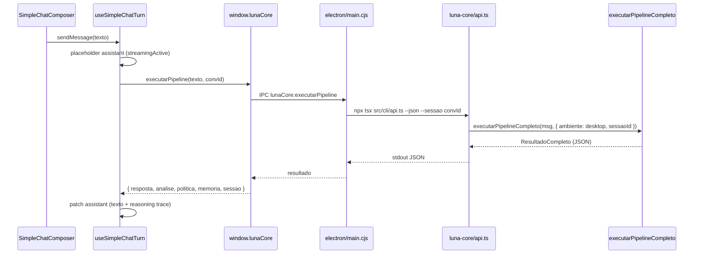

# Roadmap — Integração Luna Core × Orbit

Plano de integração entre o **motor cognitivo** (Luna Core) e o **cliente desktop** (Orbit). Atualizado em junho/2026, após validação manual do chat em produção local.

**Regra de ouro:** cada fase prova **uma hipótese**. Só avançamos quando a fase atual funciona e está documentada.

---

## 1. Visão

| Papel | Repositório | Responsabilidade |
|-------|-------------|------------------|
| **Luna Core** | `C:\Users\ethan\Documents\Core\Luna\src\luna-core` | Pipeline PAIA: análise → política → memória → resposta, sessões, memória longa |
| **Orbit** | `C:\Users\ethan\Documents\Projects\Orbit` | Shell Electron + React: chat, IDE, addons, sync cloud, UI |

O Orbit **não** é mais um cliente multi-LLM genérico. É o ambiente desktop da Luna — um único ponto de entrada para conversar com ela, com identidade, memória e política centralizadas no Core.

```
┌─────────────────────────────────────────────────────────────┐
│                         ORBIT                               │
│  AppShell · ChatColumn · IDE · Addons · Cloud Sync          │
│                                                             │
│   SimpleChatComposer ──► useSimpleChatTurn                  │
│              │                                              │
│              ▼                                              │
│   window.lunaCore.executarPipeline (Electron IPC)         │
└──────────────────────────────┬──────────────────────────────┘
                               │ subprocesso ou import Node
                               ▼
┌─────────────────────────────────────────────────────────────┐
│                      LUNA CORE                              │
│  executarPipelineCompleto (ambiente: desktop)               │
│  analisador → política → neurônio memória → respondedor     │
│  sessões · SQLite · constituição · perfil comportamental    │
└─────────────────────────────────────────────────────────────┘
```

---

## 2. Onde estamos agora

| Item | Status |
|------|--------|
| Refatoração do `AppShell` (797 → ~540 linhas, hooks agrupados) | ✅ |
| `ChatColumn` como layout puro (header / messages / footer) | ✅ |
| `useConversations` com 5 domínios (`conv`, `foldersState`, `model`, `memory`, `sync`) | ✅ |
| Chat principal via `useSimpleChatTurn` → Luna Core | ✅ |
| Label fixo **Luna · PAIA** na UI (`SimpleChatComposer`, `StatusBar`) | ✅ |
| IPC `lunaCore:executarPipeline` no Electron main | ✅ |
| Caminho configurável via `LUNA_CORE_PATH` no `.env` | ✅ |
| Remoção do piloto de presença (overlay, fila, `obterEstado`/`enfileirar`) | ✅ |
| Teste manual do chat end-to-end | ✅ |
| Limpeza do stack multi-LLM legado (chat) | ✅ I1 concluída |
| Import direto do Core (sem subprocesso) | ✅ I2 concluída |
| Streaming da resposta da Luna | ⬜ Pendente |
| Sincronização sessão Orbit ↔ sessão Core | ⬜ Parcial |
| IDE/addons usando Luna Core | 🔵 Dual stack (I5.1–5.3) |

**Fase atual:** `I5 — IDE no Core` 🔵 **em andamento** · I1–I2–I4 ✅ · I3 cancelado

---

## 3. Arquitetura da integração (estado atual)

### 3.1 Fluxo de um turno de chat



### 3.2 Arquivos-chave

| Camada | Arquivo | Função |
|--------|---------|--------|
| UI | `src/features/chat/SimpleChatComposer.tsx` | Composer fixo Luna · PAIA |
| Hook | `src/features/chat/useSimpleChatTurn.ts` | Turno do chat via Luna Core |
| Config | `src/features/chat/simpleChatLlmConfig.ts` | Constantes `luna-core` / `luna-paia` |
| Shell | `src/shell/AppShell.tsx` | Orquestra chat, addons, auth |
| Layout | `src/shell/ChatColumn.tsx` | Slots de layout do chat |
| Fachada | `src/hooks/useConversations.ts` | Estado de conversas + `sendMessage` |
| Preload | `electron/preload.cjs` | Expõe `window.lunaCore.executarPipeline` |
| Main | `electron/main.cjs` | Spawna `api.ts` no diretório do Core |
| Core CLI | `luna-core/src/cli/api.ts` | Interface JSON para apps externos |
| Core motor | `luna-core/src/pipeline/executarPipelineCompleto.ts` | Pipeline completo PAIA |

### 3.3 Configuração necessária

**Luna Core** (`src/luna-core/.env`):

```env
LUNA_API_KEY=...          # obrigatório
LUNA_API_BASE=...         # default Groq
LUNA_MODELO_MAIOR=...     # modelo do respondedor
LUNA_MODELO_MENOR=...     # modelo dos analisadores
```

**Orbit** (`.env`):

```env
LUNA_CORE_PATH=C:\Users\ethan\Documents\Core\Luna\src\luna-core
```

---

## 4. Fases do roadmap

### I0 — Piloto funcional ✅ Concluído

**Hipótese:** O Orbit consegue enviar uma mensagem ao Luna Core e exibir a resposta com o pipeline completo.

**Entregas:**

- [x] IPC `executarPipeline` no Electron
- [x] `useSimpleChatTurn` substituindo `runAgentTurn` no chat principal
- [x] `ChatColumn` + refatoração do `AppShell`
- [x] Label fixo Luna · PAIA
- [x] Remoção do piloto de presença (chamada direta, sem fila)
- [x] `LUNA_CORE_PATH` configurável
- [x] Validação manual: mensagem → resposta da Luna

**Aprendizado:** O subprocesso `npx tsx` funciona mas adiciona ~2–10s de cold start por turno. Aceitável para piloto, não para produto.

---

### I1 — Consolidação Luna-only 🔵 Em andamento

**Hipótese:** O Orbit pode operar sem depender do catálogo multi-provider para o chat principal.

**Critério de sucesso:** Boot do Orbit não faz fetch de modelos Groq/OpenRouter só para o chat; UI não expõe seletor de modelo no fluxo principal.

| # | Tarefa | Prioridade | Status |
|---|--------|------------|--------|
| 1.1 | Remover fetch de `modelCatalogStore` no boot do chat simples | Alta | ✅ |
| 1.2 | Desacoplar `StatusBar` de `modelCatalog` / `selectedModelId` quando `fixedModelLabel` está definido | Alta | ✅ |
| 1.3 | Remover `llmSelection` morto de `useConversations` → `useSimpleChatTurn` | Média | ✅ |
| 1.4 | Arquivar ou remover `ModelSelector`, `ChatComposer` (legado) do fluxo ativo | Média | ✅ |
| 1.5 | Atualizar `docs/architecture.md` (fluxo `useSimpleChatTurn`, não `runAgentTurn`) | Média | ✅ |
| 1.6 | Atualizar `README.md` do Orbit com instruções Luna Core | Média | ✅ |
| 1.7 | Documentar que `reasoningEnabled` no composer não afeta o pipeline Core (ou ligar depois) | Baixa | ✅ |

**Não remover ainda:** servidor Python (`backend/`), handlers Electron multi-provider — ainda usados pelo **modo IDE** e addons.

---

### I2 — Integração nativa (import Node) ✅ Concluído

**Hipótese:** Importar `executarPipelineCompleto` diretamente no processo main do Electron elimina o overhead do subprocesso e melhora latência.

**Critério de sucesso:** Turno de chat < 1s de overhead de integração (excluindo latência LLM). **Resultado:** ~200 ms load + ~3 s turno (vs ~10 s com `npx tsx`).

| # | Tarefa | Prioridade | Status |
|---|--------|------------|--------|
| 2.1 | Adicionar `exports` no `package.json` do `luna-core` | Alta | ✅ |
| 2.2 | Resolver path via `LUNA_CORE_PATH` + `dist/entry-desktop.js` | Alta | ✅ |
| 2.3 | Substituir `execFile('npx tsx …')` por `lunaCoreBridge.cjs` | Alta | ✅ |
| 2.4 | Paths do pacote (`RAIZ_PACOTE`) para logs/SQLite/embeddings | Alta | ✅ |
| 2.5 | Tipar retorno em `electron.d.ts` + `lunaCoreResult.ts` | Média | ✅ |
| 2.6 | `npm run luna-core:check` + `luna-core:check:electron` | Alta | ✅ |

**Pendência menor:** `better-sqlite3` no Electron requer `npm run luna-core:rebuild-electron` para memória longa (ABI Node 140). Chat funciona sem isso.

**Arquivos:** `electron/lunaCoreBridge.cjs`, `luna-core/src/entry-desktop.ts`, `scripts/check-luna-core-bridge.cjs`

---

### I3 — Streaming e UX do turno ❌ Cancelado

Decisão do produto: chat sem streaming token-a-token. Resposta completa por turno é suficiente.

---

### I4 — Sessões e memória unificadas ✅ Concluído

**Hipótese:** O `convId` do Orbit e o `sessaoId` do Luna Core representam a mesma conversa; recall entre conversas funciona.

| # | Tarefa | Status |
|---|--------|--------|
| 4.1 | `Conversation.lunaSessaoId` ↔ `sessao.id` | ✅ |
| 4.2 | `prepararSessao` no create + IPC | ✅ |
| 4.3 | `buscarContextoOutrasSessoes` + `contexto_cross_sessao` no pipeline | ✅ |
| 4.4 | `LunaCoreMemorySection` na `MemoriesPanel` | ✅ |
| 4.5 | `refletirSessao` ao apagar conversa | ✅ |
| 4.6 | `lunaSessaoId` no payload `Conversation` (cloud sync herda) | ✅ |

**Arquivos:** `luna-core/src/integracao/orbitIntegracao.ts`, `LunaCoreMemorySection.tsx`, `useLunaCoreMemory.ts`

---

### I5 — IDE e addons no Luna Core 🔵 Em andamento

**Hipótese:** Ferramentas do modo IDE podem passar pelo pipeline da Luna em vez do agente multi-LLM legado.

**Critério de sucesso (fase 1):** Chat usa Core; IDE/Finanças usam agente com tools; contrato documentado. **Fase 2:** loop híbrido Core ↔ tools.

| # | Tarefa | Prioridade | Status |
|---|--------|------------|--------|
| 5.1 | Inventariar o que `runAgentTurn` faz que o Core ainda não cobre | Alta | ✅ |
| 5.2 | Definir contrato: agentes locais (V3 Core) vs ferramentas Orbit | Alta | ✅ [`luna-ide-core-bridge.md`](./luna-ide-core-bridge.md) |
| 5.3 | `useIdeLunaCoreTurn` — IDE no pipeline Core + `contexto_ide` | Alta | ✅ |
| 5.4 | Addon Finanças: avaliar se usa Core ou agente legado | Média | ✅ documentado (agente) |
| 5.5 | Desativar servidor Python quando Core cobrir 100% dos casos | Baixa | ⬜ |
| 5.6 | Loop híbrido: `usar_ferramenta` no Core → executor Orbit | Média | ⬜ |

**Arquivos:** `useChatTurn.ts`, `ideLlmSelection.ts`, `agentTurnService.ts`, `luna-ide-core-bridge.md`

**Nota:** O IDE recuperou tools via dual stack; migração total ao Core é fase 2 (5.6).

---

### I6 — Empacotamento e distribuição ⬜

**Hipótese:** Um instalador do Orbit inclui ou referencia o Luna Core de forma reproduzível.

| # | Tarefa | Prioridade |
|---|--------|------------|
| 6.1 | Publicar `luna-core` como pacote npm interno (`@luna/core`) | Média |
| 6.2 | Bundle do Core no instalador Electron (asar ou sidecar) | Média |
| 6.3 | `.env` do Core: template + setup wizard no primeiro boot | Média |
| 6.4 | Remover paths hardcoded (`C:\Users\ethan\...`) — só `LUNA_CORE_PATH` ou relativo | Alta |
| 6.5 | CI: teste de integração Orbit + Core em pipeline | Média |
| 6.6 | Documentação de deploy para outros devs | Baixa |

---

## 5. Legado a deprecar (não urgente)

Estes componentes pertencem ao Orbit **pré-integração** (cliente multi-LLM). Mantidos enquanto IDE/addons dependem deles.

| Componente | Caminho | Substituto |
|------------|---------|------------|
| Agente multi-tool | `src/agent/runAgentTurn.ts` | Pipeline Core + agentes V3 |
| Turno legado | `src/_archive/chat-legacy/agentTurnService.ts` | `useSimpleChatTurn` ✅ |
| Catálogo multi-provider | `src/features/chat/state/modelCatalogStore.ts` | `simpleChatLlmConfig.ts` |
| Seleção de modelo | `src/lib/llmModelSelection.ts` | Fixo Luna · PAIA |
| Composer legado | `src/features/chat/components/ChatComposer.tsx` | `SimpleChatComposer` ✅ |
| Seletor de modelo | `src/components/ModelSelector.tsx` | Label fixo ✅ |
| Servidor Python LLM | `backend/luna/llm/` | Luna Core |
| Handlers Electron LLM | `electron/groqHandlers.cjs`, etc. | IPC `lunaCore` |
| Presença multi-portal | ~~`PresenceOverlay`~~, ~~`useLunaPresence`~~ | Removido ✅ |

**Estratégia:** deprecar por camada — chat primeiro (I1), IDE depois (I5), servidor Python por último.

---

## 6. Contrato de integração (referência)

### IPC atual (renderer → main)

```typescript
window.lunaCore.executarPipeline(mensagem: string, sessaoId?: string): Promise<ResultadoCompleto>
```

### Resposta esperada (`ResultadoCompleto`)

| Campo | Uso no Orbit |
|-------|--------------|
| `resposta.texto` | Texto principal da assistente |
| `analise.analise` | Trace de reasoning (intenção, risco) |
| `pipeline.politica` | Trace de reasoning (ação, tom) |
| `memoria.decisao` | Trace de reasoning (ação memória) |
| `sessao.id` | ID de sessão para turnos seguintes |
| `error` | Mensagem de erro (quando falha) |

### Ambiente

O Core recebe `ambiente: "desktop"` via `api.ts`. O Orbit **não** precisa gerenciar presença, fila ou daemon — o Core atualiza `estado.json` internamente ao processar cada turno.

---

## 7. Métricas de acompanhamento

| Métrica | Alvo I0 | Alvo I2 | Alvo I3 |
|---------|---------|---------|---------|
| Latência overhead integração | < 10s | < 1s | < 1s |
| Turno completo (excl. LLM) | ~3s | ~200ms | ~200ms |
| Cobertura chat Luna-only | 100% | 100% | 100% |
| Cobertura IDE Luna Core | 0% | 0% | 0% |
| Streaming | Não | Não | Sim |
| Testes automatizados integração | 0 | ≥ 3 | ≥ 5 |

---

## 8. Riscos

| Risco | Impacto | Mitigação |
|-------|---------|-----------|
| Subprocesso lento (estado atual) | UX ruim em turnos rápidos | I2 — import nativo |
| CWD / paths do Core em build empacotado | Chat quebra em produção | I6 — paths relativos + testes CI |
| Dual stack (Core + servidor Python) | Confusão, bugs de modelo errado | I1 limpa chat; I5 documenta IDE |
| Sessões dessincronizadas | Luna "esquece" contexto da UI | I4 — mapeamento explícito |
| `.env` do Core ausente no deploy | Erro silencioso ou mensagem críptica | Setup wizard + validação no boot |

---

## 9. Links relacionados

| Documento | Repositório | Conteúdo |
|-----------|-------------|----------|
| [architecture.md](./architecture.md) | Orbit | Camadas e fluxo (atualizar na I1) |
| [luna-brain-v1-spec.md](./luna-brain-v1-spec.md) | Orbit | Spec do cérebro Luna no Orbit |
| [ROADMAP.md](https://github.com/...) | Luna Core | Roadmap do motor (`Teses de Arquitetura/old/ROADMAP.md`) |
| [DIARIO-FASES.md](https://github.com/...) | Luna Core | Diário de execução do Core |
| [WHITEPAPER-LUNA-PAIA.md](../../Core/Luna/Teses%20de%20Arquitetura/WHITEPAPER-LUNA-PAIA.md) | Luna Core | Arquitetura PAIA e papel do Orbit |

---

## 10. Painel rápido (checklist semanal)

```
I0  Piloto funcional          ████████████████████  100%  ✅
I1  Consolidação Luna-only    ████████████████████  100%  ✅
I2  Import Node nativo         ████████████████████  100%  ✅
I3  Streaming                  — cancelado —
I4  Sessões unificadas         ████████████████████  100%  ✅
I5  IDE no Core                ████████░░░░░░░░░░░░   40%  🔵
I6  Empacotamento              ░░░░░░░░░░░░░░░░░░░░    0%  ⬜
```

**Próxima ação recomendada:** I5.6 — loop híbrido quando `politica.acao === usar_ferramenta`. Testar IDE com `npm run dev` + servidor Python.

---

*Última atualização: 2026-06-09 · Responsável: Ethan Noward*
